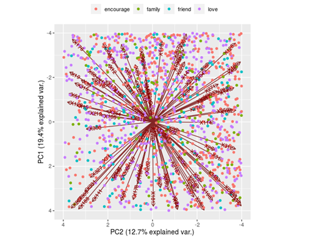
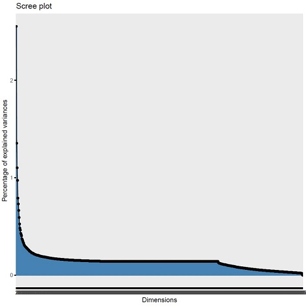
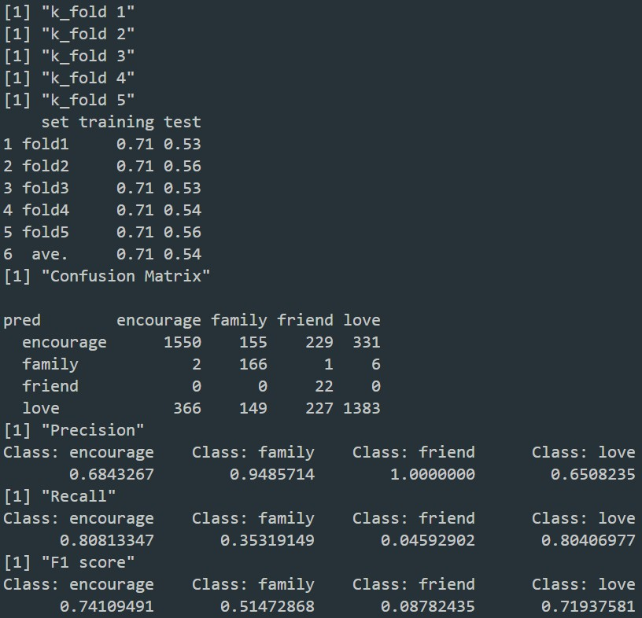
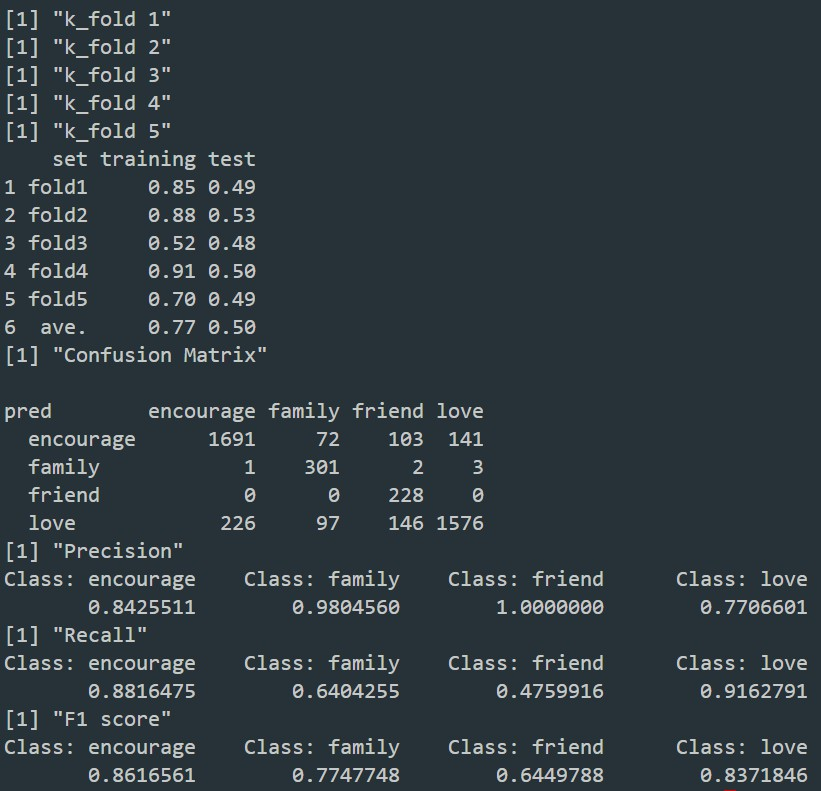
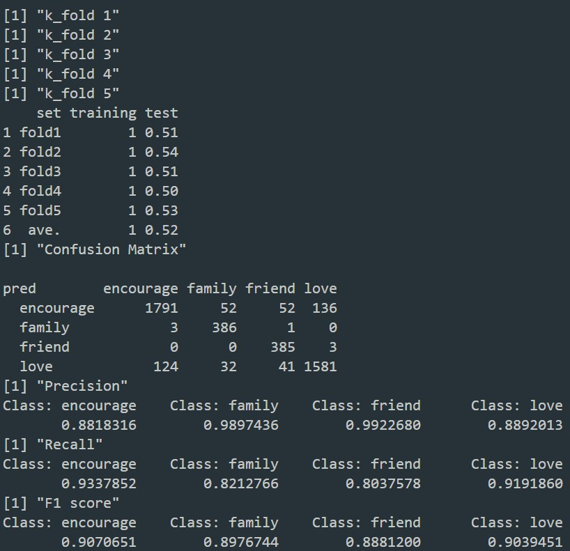

# 資料科學期末報告
# 歌詞在敘事情緒上的自動分類

### 組員

資科四    陳岳紘	106703003	
 
資科四    蔣翰宗	106703004
  
資科四    吳奇峰	106703024
 
資科四    劉煥澤	106703028
 
資科四    謝宇星	106703033

資科四    陳冠盛	106703052

## 資料說明

* 001_中文資料.csv：歌曲的raw data，包含歌名、歌詞、分類、作詞者、作曲者、發行年份與收藏頻率。
* 002_w2vDim400_1215.csv：將歌詞透過word2vec進行word embedding取400維。
* 003_tfidf_0110.csv：將歌名透過word2vec進行word embedding取400維、歌詞透過tf-idf進行word embedding後透過svd降維至200，另有新增歌曲的情感分數(Valence, Arousal)2維。

## 分類目標

預測各歌曲種類，分別為：
  1) encourage(勵志)
  2) family(親情)
  3) friend(友情)
  4) love(愛情)

## Null Model

1) encourage：0.418
2) love：0.102
3) friend：0.104
4) family：0.375

猜機率最高之encourage

* How do you perform evaluation?
  * n fold cross validation
  * accuracy

## 採用的方法

* SVM
* KNN
* RandomForest

## 視覺化網頁

[Click Me](https://zovjsra.shinyapps.io/final_vis_app/)

 

## 結果

### SVM

### KNN

### RandomForest

* 如何產生結果？

<pre><code>Rscript svm.R/knn.R/randomForest.R --fold 5 --train ../data/002_w2vDim400_1215.csv --report performance.csv</code></pre>
    
## 總結

### 資料前處理挑戰：
  * 結巴斷詞 V.S. CKIP斷詞 → CKIP斷詞效果較佳
  * Word2Vec V.S. Tf-Idf → Word2Vec效果較佳
### 是否有很明顯的進步?
  * 沒到非常明顯，從0.418到0.54左右
### 最具挑戰的部分?
  * 資料本身並非非常平均
  * 歌詞轉換成word2vec時，是否真的能當作好的feature

## 參考資料

* https://rpubs.com/skydome20/R-Note14-SVM-SVR
* https://mojim.com/
* https://www.xiami.com/

* Packages：
  + kknn
  + caret
  + e1071
  + randomForest
